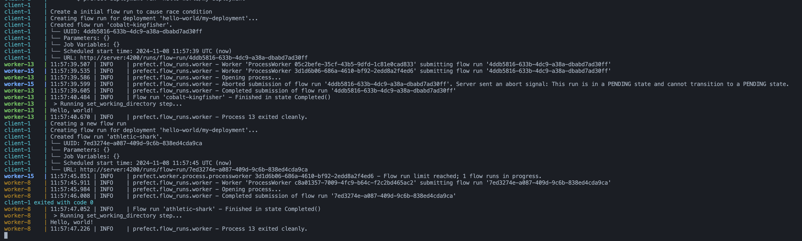

# Minimal re-creation of [15952](https://github.com/PrefectHQ/prefect/issues/15952)

## Steps to reproduce

1. Run `docker compose up --build`
2. Wait for the client script to finish
3. Observe the output after the first flow run and look for a worker which has output the following, if no workers have output this message, re-run the client script until the race condition is hit
```Aborted submission of flow run ?. Server sent an abort signal: This run is in a PENDING state and cannot transition to a PENDING state.```
4. Observe the output after the second flow run and look for the same worker outputting the following message
```Flow run limit reached; 1 flow runs in progress.``` This worker is not processing any flow runs and is now indefinitely stuck

## Example

See the output from `worker-15`


